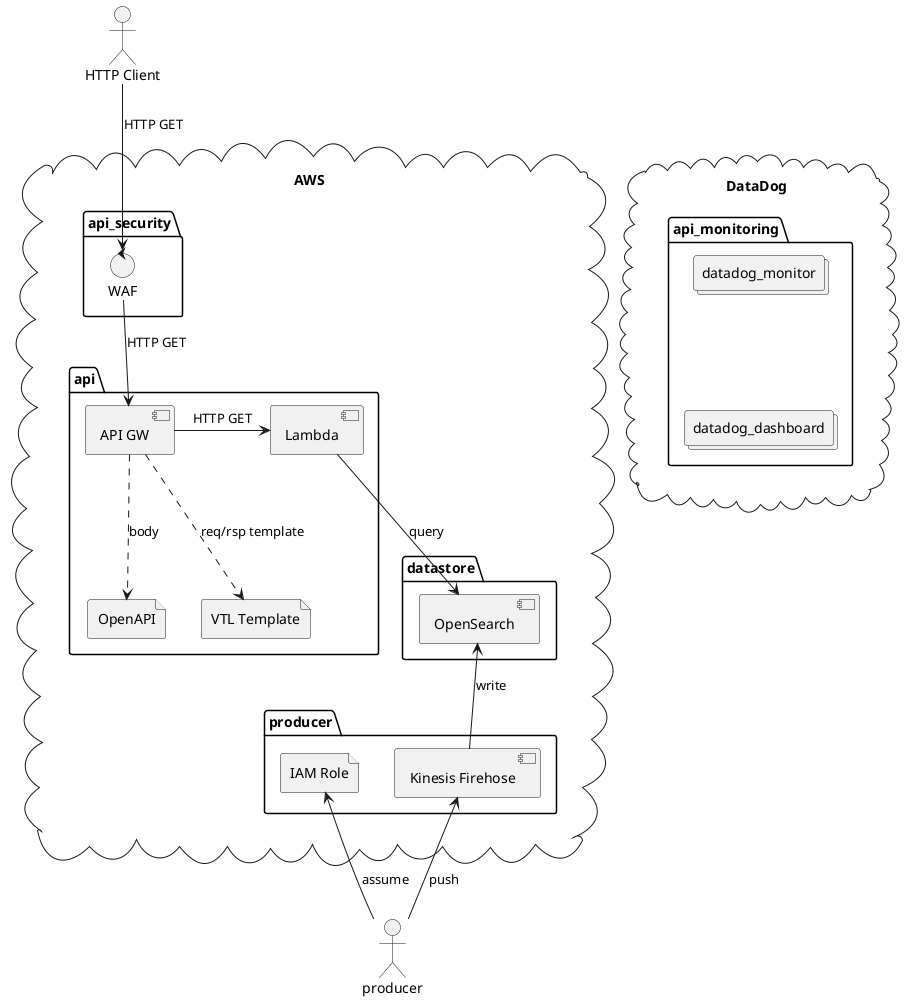

# Accounting Service

Producer writes accounting data which is stored in ElasticSearch cluster.

## Design

```plantuml
@startuml


cloud "AWS" as cloud_aws {
    package "producer" as pkg_prod {
     component "Kinesis Firehose" as firehose_api
     file "IAM Role" as producer_iam
    }
    
    package "datastore" as pkg_db {
     component "OpenSearch" as db
    }
    
    package "api" as pkg_api {
     component "API GW" as api
     component "Lambda" as lambda_query 
     file "OpenAPI" as openapi
     file "VTL Template" as vtl
     
     api -> lambda_query : HTTP GET
     api ..> openapi : body
     api ..> vtl : req/rsp template
    }
    
    package "api_security" as pkg_api_sec {
     control "WAF"as api_waf
    }
}

cloud "DataDog" as cloud_dd {
    package "api_monitoring" as pkg_api_mon {
     collections "datadog_monitor" as dd_monitor
     collections "datadog_dashboard" as dd_dash
     dd_monitor -[hidden]- dd_dash
    }
}

cloud_dd -[hidden]left- cloud_aws

api -[hidden]left- api_waf


actor producer
producer -up-> firehose_api : push
producer -up-> producer_iam : assume

firehose_api -up-> db : write

lambda_query --> db : query

actor "HTTP Client" as client_http
client_http --> api_waf  : HTTP GET
api_waf --> api  : HTTP GET
@enduml
```
